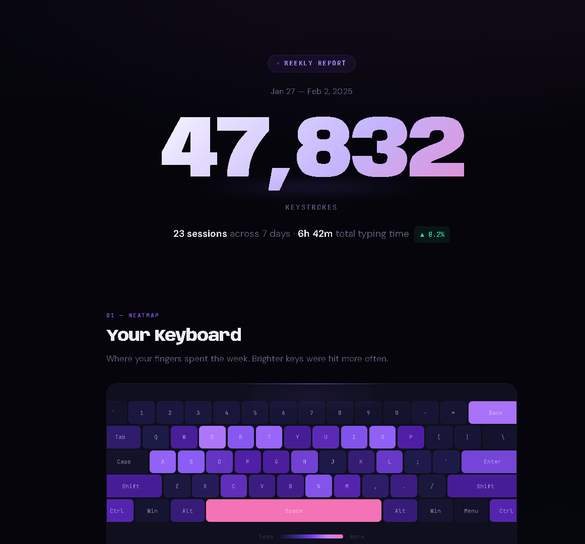

# KeyHeat

**Spotify Wrapped, but for your keyboard.**

A local background daemon that tracks your typing speed, key frequency, and shortcut habits — then generates a beautiful weekly report you'll actually want to screenshot.

**100% offline. No accounts. No telemetry. Your data never leaves your machine.**

Built this because I wanted to see how I actually use my keyboard. Turns out I hit Backspace more than I'd like to admit.



## What You Get

**A weekly report with:**
- Keyboard heatmap — see exactly where your fingers live
- Typing speed — average WPM, peak WPM, daily trends
- Activity grid — GitHub contribution style visualization of when you type
- Shortcut leaderboard — your most used combos, ranked
- Fun stats — finger travel distance, backspace ratio, night owl score

The report is a single self-contained HTML file. No dependencies, no JavaScript frameworks — just inline SVG and CSS. Open it in any browser, share it, screenshot it.

## Install

```bash
git clone https://github.com/0xSaiNova/keyheat.git
cd keyheat
cargo build --release
```

## Quick Start

**Try it instantly (no permissions needed):**
```bash
keyheat run --mock
```

Generates synthetic keystrokes so you can see the full pipeline — sessions, WPM tracking, shortcuts, everything. Run it for a minute, then:

```bash
keyheat report --format html
```

Opens a full report in your browser with heatmap, charts, and stats.

**Run for real (Linux):**
```bash
# Option 1: Run as root
sudo keyheat run

# Option 2: Add yourself to the input group (recommended, no sudo needed)
sudo usermod -aG input $USER
# Log out and back in, then:
keyheat run
```

Needs access to `/dev/input/event*` to read keyboard events. Data saves to `~/.local/share/keyheat/keyheat.db`.

**Generate reports:**
```bash
keyheat report                    # Terminal summary
keyheat report --format html      # Full visual report
keyheat report --week 2025-W06    # Specific past week
```

HTML reports are saved to `~/.local/share/keyheat/reports/`.

## How It Works

KeyHeat runs as a foreground process that reads keyboard events via Linux's evdev interface. It doesn't log what you type — it only records key codes, timestamps, and modifier state. No text is ever reconstructed.

- **Key counts** are aggregated per key per day and flushed to SQLite every 5 seconds
- **Sessions** are detected automatically — 30 seconds of idle time starts a new session
- **WPM** is calculated using a rolling 30 second window, sampled every 10 seconds
- **Shortcuts** are detected when modifier keys are held with another key (Ctrl+C, Alt+Tab, etc.)

Everything lives in a single SQLite database. You can query it directly:

```bash
sqlite3 ~/.local/share/keyheat/keyheat.db "SELECT key_code, count FROM key_counts ORDER BY count DESC LIMIT 10"
```

## Privacy

Yeah, it's a keystroke tracker. That sounds sketchy. Here's why it's not:

- **No network code at all.** Seriously, grep the codebase for `reqwest`, `hyper`, `TcpStream`, any HTTP client. You won't find any. There is zero networking in this project.
- **No text reconstruction.** KeyHeat stores key codes (`"a"`, `"space"`, `"backspace"`), not characters or sequences. It counts how many times you hit each key, not what you typed.
- **Everything stays on your machine.** SQLite database in `~/.local/share/keyheat/`. That's it. No cloud, no sync, no analytics.
- **You build it yourself.** You clone the repo, you run `cargo build`, you see exactly what goes into the binary.
- **Small codebase.** Around 2,000 lines of Rust. You can read the whole thing in an afternoon.

## Stack

- **Rust** — single binary, low overhead
- **evdev** — Linux kernel input events
- **SQLite** (WAL mode) — embedded storage, zero config
- **Raw HTML/SVG** — the report is generated as a single self-contained `.html` file with inline CSS and SVG. No React, no Tailwind, no build step.

## Roadmap

**In progress:**
- [ ] **macOS support** — `CGEventTap` for native keyboard capture
- [ ] **Windows support** — `WH_KEYBOARD_LL` hooks via raw input API

**Planned:**
- [ ] **Daemon mode** — `keyheat start/stop/status` with proper backgrounding
- [ ] **Config file** — custom idle threshold, report styling, keyboard layout (Dvorak, Colemak)
- [ ] **Per app tracking** — break down stats by which application is in focus
- [ ] **TUI dashboard** — live WPM, session timer, and key counts in the terminal
- [ ] **CSV/JSON export** — dump your data for custom analysis

## Why Not WhatPulse / Other Tools?

Most keyboard analytics tools want you to create an account, sync to their servers, and share "anonymous" data. I wanted something where my keystrokes stay on my computer.

- **No account required.** No email, no signup, no "continue with Google."
- **No network dependency.** Works on an airgapped machine. Works offline forever.
- **Lightweight.** Under 5MB RAM, negligible CPU. Runs in the background without you noticing.
- **Hackable.** Small Rust codebase. Add your own stats, change the report design, fork it.

## License

MIT
